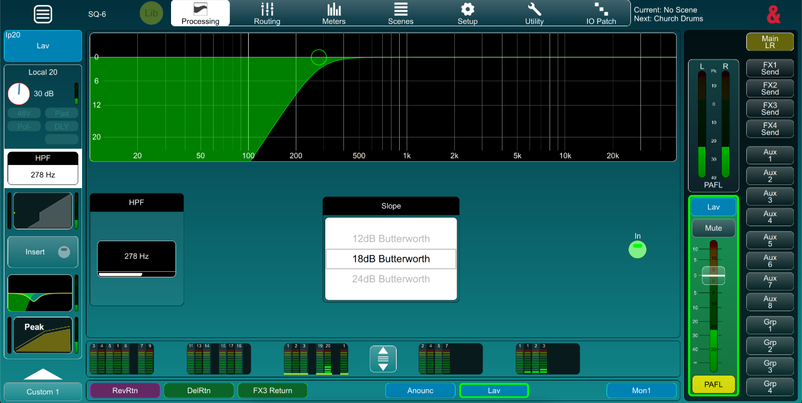
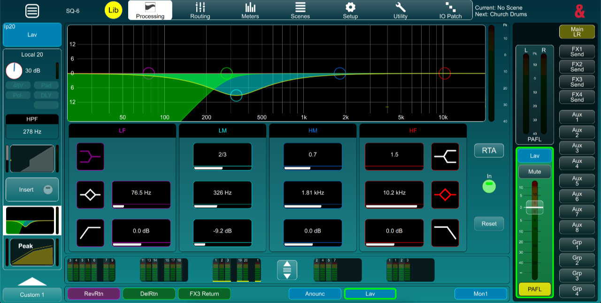
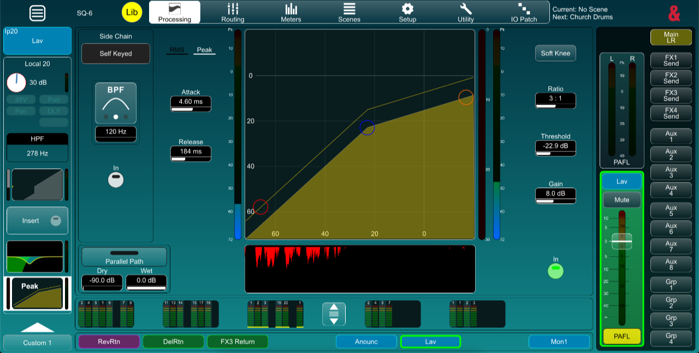

> **The pictures in this article are referencing the recording from Family Church Billinge made by Nolan Bradshaw. You can access the recording by visiting our podcast feed on Spotify, or the website at the link below.**
>
> The website and podcast recording has been mastered after the service and does not represent the exact conditions for the live environment, or in the video below
>
> [Nolan Bradshaw - Prayer (23rd November 2025)](https://familychurch.org.uk/listen/listen-single/?sermon=prayer)

## Introduction

The lapel microphone is one of the most difficult inputs to manage on our sound desk and requires fine adjustments to get the best quality sound from it. Following our training session, I put some of my own advice into practice on this date to get the best sound I could manage, and I think the results will show that the settings were quite effective.

Speaking this week was Nolan, who has quite a clear tone and is generally easy in terms of clear sound, but difficult in terms of dynamics. Nolan's tendency is to talk at almost a whisper, and then jump up in volume. Previously this has required either riding the fader on the console, or putting up with severe quiet moments that are almost inaudible, or painful listening when he is loud.

The results I managed to obtain still weren't perfect, and you can hear some clipping still in the audio caused by the plosives on the microphone. I decided to not reduce the gain any further due to Nolan's whisper moments; it was a compromise to keep enough signal in the desk versus reducing the clipping when he was loud. This will make sense when you hear the recording and see my screenshots.

## HPF

> 

HPF, or High Pass Filter, is a function on every input channel of the sound desk. The HPF does what it says, it lets high frequencies pass through, and cuts low frequencies out.

Plosives are the sounds made by a microphone usually from excess wind from the mouth around the letter "p". Try it now, say the word "PLOSIVE". Start with your mouth closed and don't open it until the pressure in your mouth opens your lips. The air that comes out can get caught by a mic and that is the effect we want to quash. Obviously this is exaggerated from normal use.

> 

I usually. recommend a HPF set to around 180Hz on a vocal mic, but looking at the image below, you can see that I was a little more invasive with the HPF for this recording. The primary reason for this was to remove as much of the plosive sound as possible.

The image above shows that I have also adjusted the slope of the cut on the filter. The default is 12db Butterworth, but I chose the 18db to increase the slope, therefore making it steeper and cutting more of the LF.

## PEQ

> 

The Parametric Equaliser is our primary tool to adjust the tone of the selected input or output. By default, our sound desk is configured to display a real time analyser (RTA) of the audio from the selected channel, over the PEQ graph. This helps us manage the tone as we can see any peaks and troughs in the audio that may need to be adjusted


As previously mentioned, Nolan does have a very clean sounding tone to his voice so not much work was needed. He does also generally speak quite loudly so feedback isn't usually a concern as it might be with someone with a quieter voice.

Tone and clarity covered, we can see below that not much work was required by the PEQ to achieve a good tone from the microphone.

As always, good microphone placement is essential. The mic is required to be central to the body, not too far down the chest and not too far up. Probably the best location is directly between the mouth and sternum.

## Compression

> 
> Compression is a tool used to effect control of the dynamic range of the signal. This means reducing the gap between the loudest moments, and the quietest moments. Usually this results in the overall signal being quieter. To compensate, we then apply an amount of gain to bring the quiet levels back up to an appropriate level.
> 

The compression applied to the mic on this occasion was most essential due to the aforementioned dynamics native to Nolan's style. The result was a natural sounding output from the PA system whilst maintaining suitable levels so that when Nolan "whispered", he was still audible, and when he was loud, people weren't having to cover their ears.

The image above shows the settings applied for this session. Attack and Release were left at the default, but Peak was chosen as the compression method. Ratio was left at the default of 3:1 which is around middle of the range for speech.

**Threshold** is the important setting that can only be set once the gain and EQ have been correctly applied for the most accurate result. I would suggest the ideal setting for the threshold is such that the compressor is lightly compressing during normal levels, and barely active at all when Nolan was "whispering".

Finally, I added some gain after the compressor. When the compressor is working, it is reducing the dynamic range of the signal by reducing the difference in level between the loudest and quietest parts of the signal. This makes our audio all in all quieter. To compensate, we add some gain after the compressor, bringing our quiet sections up to an appropriate level, but keeping the range of the dynamics the same.

The histogram in the image above shows a moment where Nolan had been relatively loud and the compressor had kicked in quite a lot to compensate. When this happened, a keen listener may have heard Nolan more from his own voice as opposed to hearing him from the PA system, but the overall level in the room would have been similar. The unmastered recording will likely be quite noticeable and sound unnatural when listened back to.

## Conclusion

I've put together a short video clip of an edited section of the recording. I made a recording of the lapel input without any EQ or compression (I did add some EQ back in), and the stereo record that went to the PA system.

The clip below shows the same section of audio twice. The first play through is the lapel mic with no compression applied, and you can visually see on the waveform the difference between the loud sections and quiet sections. When the clip plays through the second time with the stereo record, listen to the difference between the loudest parts and quietest and note the difference in the waveform as well. This is all due to the compressor settings.



> Note that the tone is different simply because I've done a similar EQ but my post editing can't fully replicate the exact EQ on the console.
