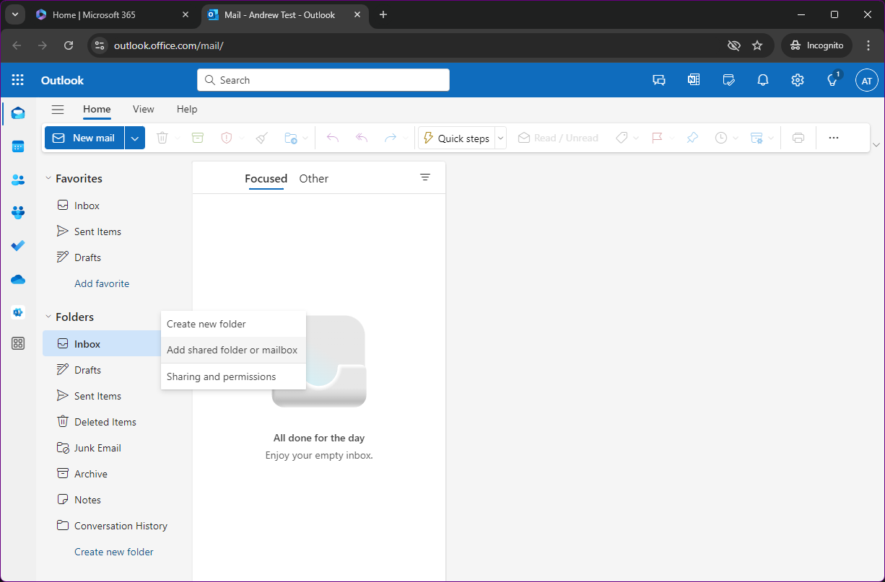
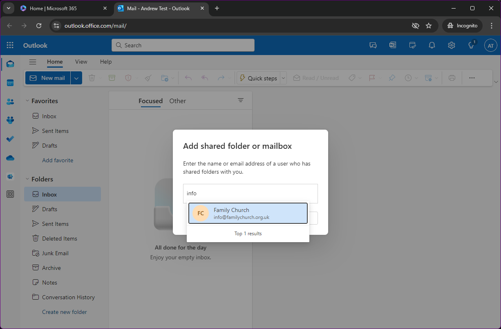
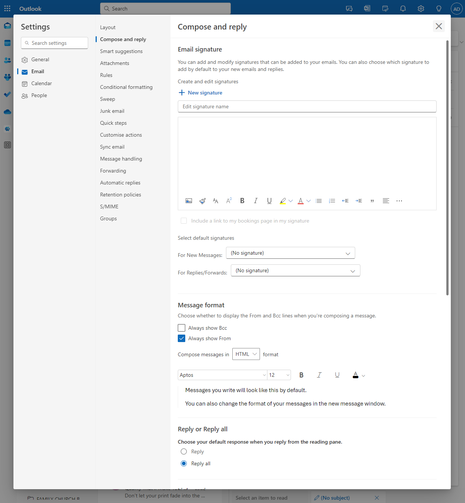

> **A shared mailbox allows you to access a generic email inbox, not aimed for a particular person but rather a group, or team of people**

## Introduction

Family Church has moved it's main contact email addresses from standalone inboxes to shared mailboxes. There are several benefits to this, primarily security, and access control.

Using a regular email inbox for a team certainly is easy for the team members. Everyone knows how to get to the login page, and everyone knows the password. There are some drawbacks to this though.

First of all, if a team members gets a virus on their computer and the password is compromised, now that needs to be reset and the team members need to be told the new password. How do you inform the team? Do you call them? Do you tell them in the lower hall? Do you text it to them? All very easy to do, but also very insecure.

Secondly, a member of the team wants to retire. Do you say, thank you for your service, God bless, and then carry on? Probably. But it's not secure. The password should be changed in order to prevent unauthorised access.

There are numerous reasons why this is a bad idea and poor practice, and ultimately Family Church has a responsibility to keep the data it holds secure.

## Accessing your mailbox

In order to access the mailbox, you will need to have a Microsoft Account with Family Church, and it will need to be properly secured. If you think you need access to a mailbox, you should get in touch with the church board.

Once you have an account, you then need permission to access the mailbox. Again, speaking to the board will get you this permission.

Once that is all done, you can then either go to [www.outlook.com](https://www.outlook.com) and log in to access **your** email account, or use the Microsoft Outlook application on your computer, tablet or mobile phone.

> **Important to note that this is not the shared mailbox.**

## Accessing the shared mailbox

>

Once logged in to what is called the Outlook Web App, or OWA, it is very easy to access a shared mailbox.

If you hover your mouse over the heading, `Folders` in the left hand menu bar, three dots appear. Click these to open a menu where the second option is `Add shared folder or mailbox`.

This option pops open another menu where you can type in the email address of the shared mailbox. Click the email and click Add.

Now the shared mailbox is available to you in the left hand menu. It appears as a completely separate inbox and all emails sent to it will be separate to any emails sent to your Family Church email address.

## Adding `from`

When sending emails, you need to be able to send from either your own email address, or from the shared mailbox. Default behaviour in Microsoft Office 365 is to send from your own email address, even when replying to an email in a shared mailbox.

In order to configure this in OWA, click on the cog in the top right of the screen to open the settings menu. In the middle left column, select the second from the top option, `Compose and reply`.

Part way down this page is a section called **Message format**. Under this is an option, `Always show From`. This option enables an extra field when sending and replying to email messaged.

With this option enabled, in OWA when composing an email, to the right of the send field is a new `From` field. There is a small down arrow to open a menu to select which email address you want to send the email from.

If the shared mailbox email address isn't in the dropdown list, click `Other email address...` and type in the email address.



>

Microsoft has recently introduced the new Outlook for PC and macOS. Thankfully, the PC version of the app will automap the shared mailbox.

Once the Outlook app is installed (find this in Microsoft Store if it isn't already on your computer), simply open the app. If it is the first time you have used Outlook on your computer, you will be presented with a log in form for your Microsoft Account. Simply enter your credentials, verify with MFA, and you should see your email mailbox.

> **Note that this is not the shared mailbox**

Your mailbox has multiple folders in it, such as `Inbox`, `Outbox`, `Sent Items` and so on. One of the folders is called `**Shared with me**`. If you expand this folder, you should see the shared mailboxes that you have access to.



>

Unfortunately for users of macOS devices, Microsoft has not made the automap feature work in Outlook at the moment.

Once you have the Outlook app installed and open, you should see a login prompt if it's the first time you have opened the application. Enter your credentials and verify with MFA and you should see your Family Church mailbox.

> **Note that this is not the shared mailbox**

In order to add the shared mailbox, you need to click the following buttons:
- Outlook menu, located in the very top left of the screen. If it reads `Finder`, make sure you have Outlook in focus by clicking on the Outlook window.
- Settings
- In the settings window, click `Accounts`
- You will now see any email accounts you have in Outlook. Click on your Family Church email account
- Click `Delegation and Sharing` button
- In the new window, there is a tab at the top, `Shared with me`
- In Shared with me, you can click the little + icon
- Type in the email address of the shared mailbox you have access to, click on the email when it appears and then click add. Repeat this step for all shared mailboxes you have access to
- Click `Done`
- Close the settings window

If you have been able to successfully follow these steps, you should now see the shared mailbox on the left hand side of the screen. It will display as though it is a completely separate mailbox to your own.

