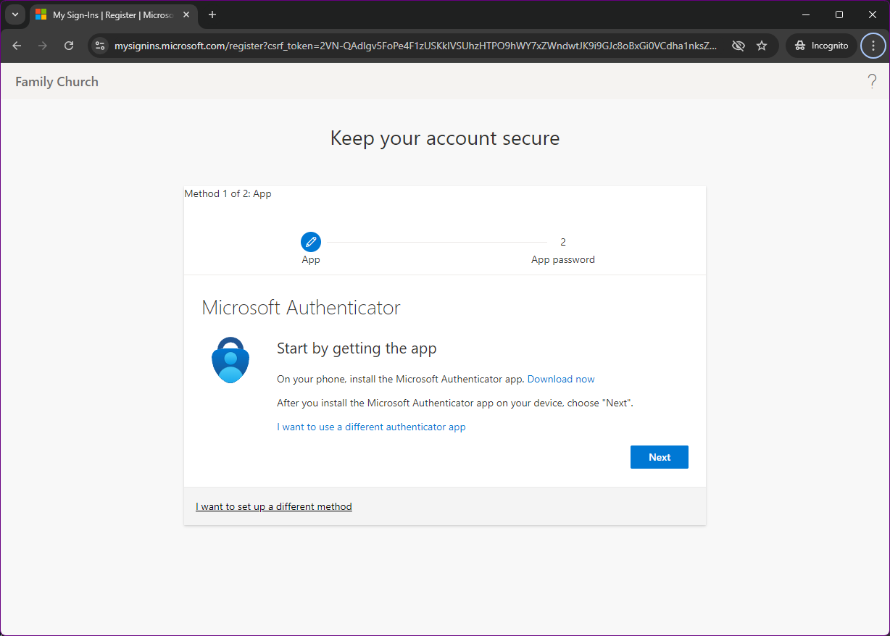
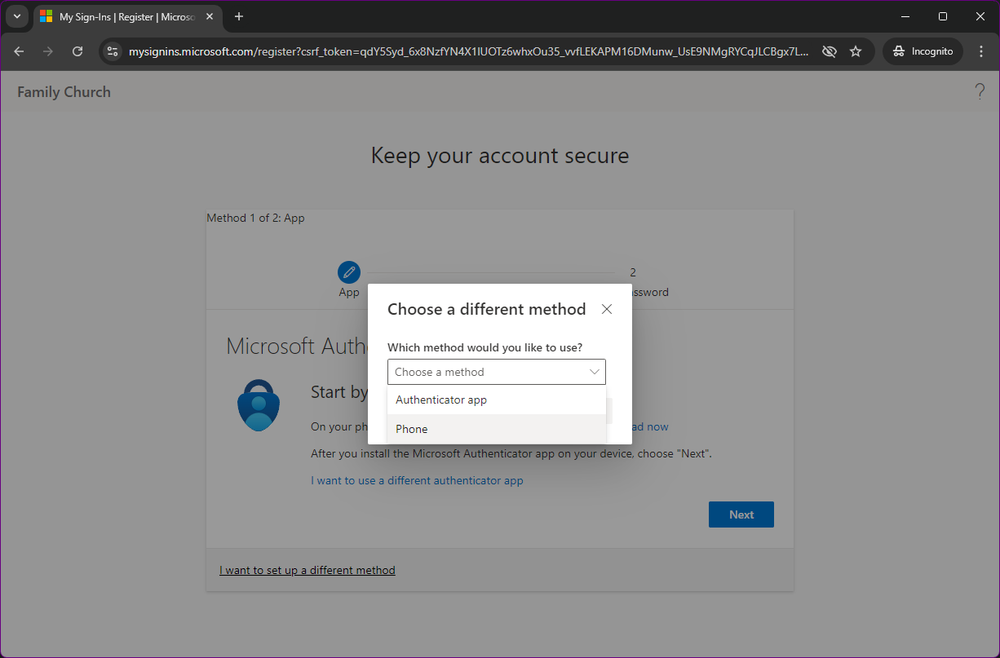
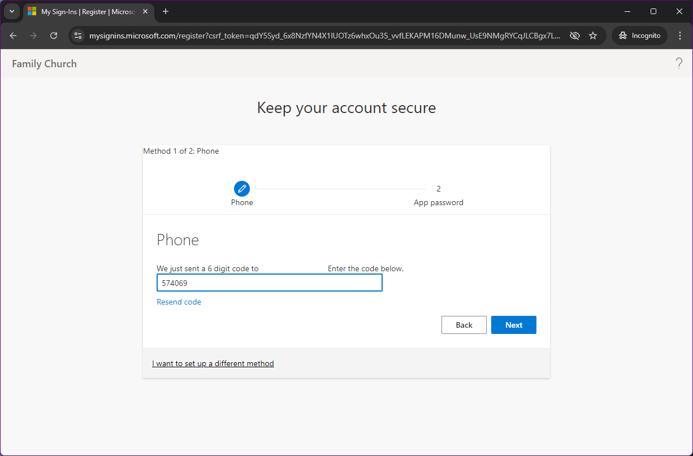
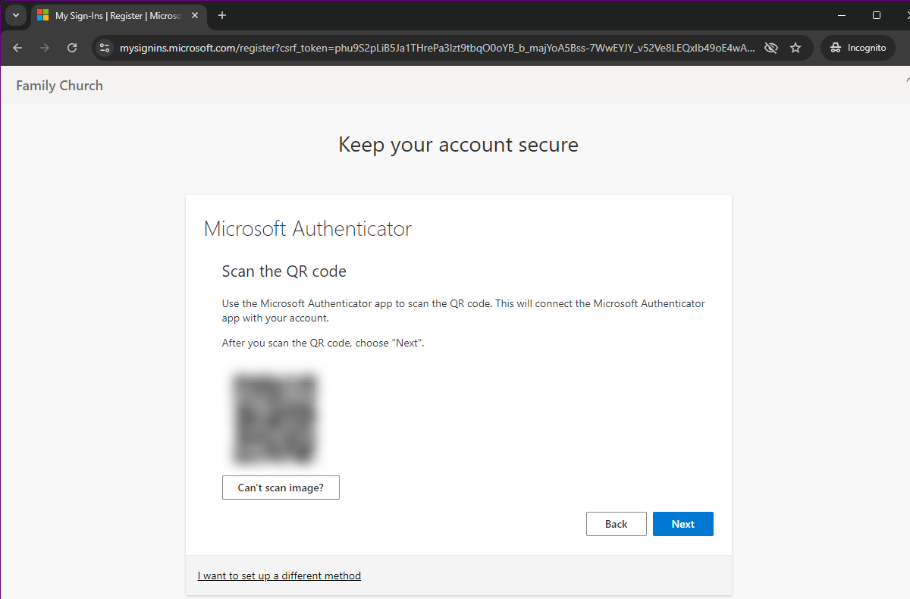

> **This guide will walk you through setting up your Family Church Microsoft Account. This account is to be used to access Church services, such as email mailboxes, and shared volumes.**
> 
> **It is very important for you to understand that the account you are setting up is assigned specifically to you. This account will provide you with access to all the of the services you require, and you should not allow anyone else to know the password, nor should you allow anyone else to use your account.**

## What you'll need

1. Your new username and password
2. A mobile phone
3. The Microsoft Authenticator app (optional)

## Getting started

The first step to accessing your Microsoft Account is to log in. The best place to do this is at [www.office.com](https://www.office.com). Click the `Sign in` button on the page to be taken to the log in form.

After you enter your new Family Church email address and provided temporary password, you will receive a prompt, requesting you to provide more information. Click the blue next button.

## Multi Factor Authentication

> **We have a topic on MFA, what it is and why it's important which you can find [here](/posts/what-is-mfa)**

The next section is where we configure Multi Factor Authentication, or `MFA`. This process requires two forms of identification which are:
- your password
- a code issued to you by your mobile device

The code from your mobile device can be retrieved in one of two ways, which we are going to configure now.

The first, and simplest method, is to be sent an SMS text message whenever you attempt to log in to the account. This message will contain a unique code that is valid for a short period of time.

The second method takes a little more work to setup up however it is arguable more secure and easier in the long run. This method requires the use of the Microsoft Authenticator App. Although other authentication apps can be used they won't be covered here. Once configured, this app will issue a push notification on your phone, requiring your phones passcode or biometric ID to be used to access and confirm it is you logging in to the account.

> 

If you wish to use the SMS method for receiving codes, you need to click the link near the bottom of the page that reads, `I want to set up a different method`. This opens a menu that allows you to select from the two options available, `Authenticator app` and `Phone`. For this method we will select Phone.

After selecting phone, follow the steps to change your country code to United Kingdom, enter your mobile phone number and click `next`. You may need to enter some on screen characters to prove you are not a robot.

Following the instructions, you should land on a screen asking for a 6 digit code. This will be sent to you via SMS and you should receive it within approximatley 60 seconds. Enter the code and after clicking next, your MFA should be configured.

Once this step is completed, the final step will be to create a new password.

**The password you create in this step is for you only, and should not be shared with anyone. If you forget it, it can be reset by Andrew who can issue a temporary password**



> 

If you wish to use the Microsoft Authenticator App for security, click the blue `Next` button.

You will continue through some steps where you need to install the app on your phone and open it for the fist time. **Make sure you allow notifications**

On your phone, you can add an account on your phone using the plus icon, and then select "Work or school". When you are at this stage on your phone, you should have clicked through on the computer until you can see a QR code, similar to the one below (we have blurred the code in the image below)

After clicking on "Work or school", your camera should open and you can scan the code. Once scanned, click next.

At this stage, it is pretty much complete. The system will run a check by testing that the app is now working. It should display a code on the website, whilst simultaneously sending a notification to your phone. When you click on the notification (or if the Authenticator app is still open it will just appear on screen), it will ask you to enter the two digit code into your phone. Once complete, the website will update to confirm everything is working.



## Updating password

The final step in this process is to update your password. Clicking next through the wizard should take you to a pretty standard password reset form.

**Remember that this will be your password, not a password that you share with others**