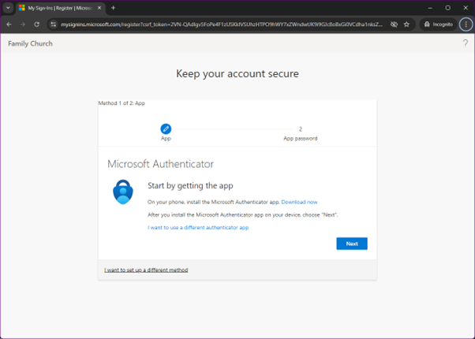

## What you'll need

1. Your new username and password. Contact Andrew Davies if you aren't sure what these are
2. A mobile phone
3. The Microsoft Authenticator app (optional)

## Getting started

The first step to accessing your Microsoft Account is to log in. The best place to do this is at [www.office.com](https://www.office.com). Click the `Sign in` button on the page to be taken to the log in form.

After you enter your new Family Church email address and provided temporary password, you will receive a prompt, requesting you to provide more information. Click the blue next button.

## Multi Factor Authentication

The next section is where we configure Multi Factor Authentication, or `MFA`. MFA greatly increases the security of your account, and the data that is held by the church. This process requires two forms of identification which are:
- your password
- a code issued to you by your mobile device

The code from your mobile device can be retrieved in one of two ways, which we are going to configure now.

The first, and simplest method, is to be sent an SMS text message whenever you attempt to log in to the account. This message will contain a unique code that is valid for a short period of time.

The second method takes a little more work to setup up however it is arguable more secure. This method requires the use of the Microsoft Authenticator App. Although third party apps can be used they won't be covered here. This app can then issue a push notification on your phone, requiring biometric ID to be used to access and confirm it is you logging in to the account.

### SMS MFA

If you wish to use the SMS method for receiving codes, you need to click the link near the bottom of the page that reads, `I want to set up a different method`.

### Authenticator App MFA

If you wish to use the Microsoft Authenticator App for security, click the blue `Next` button.
